# Getting Started

### Reference Documentation
Below is the Application set up:  
I have used Spring boot3.4 and JDK17 with Maven to complete this assessment.
### H2 Database set up

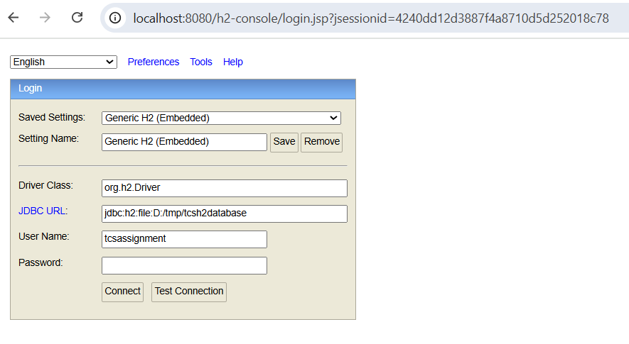

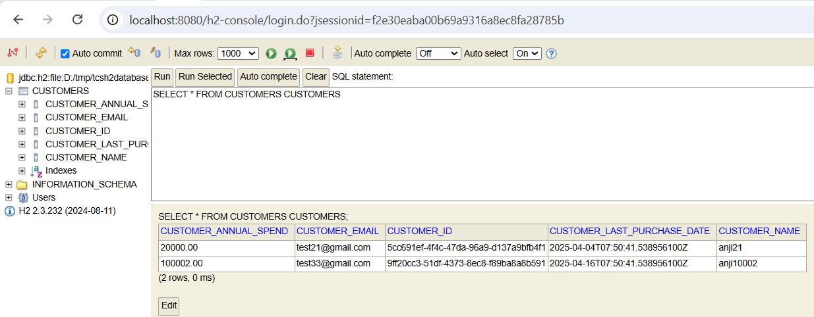

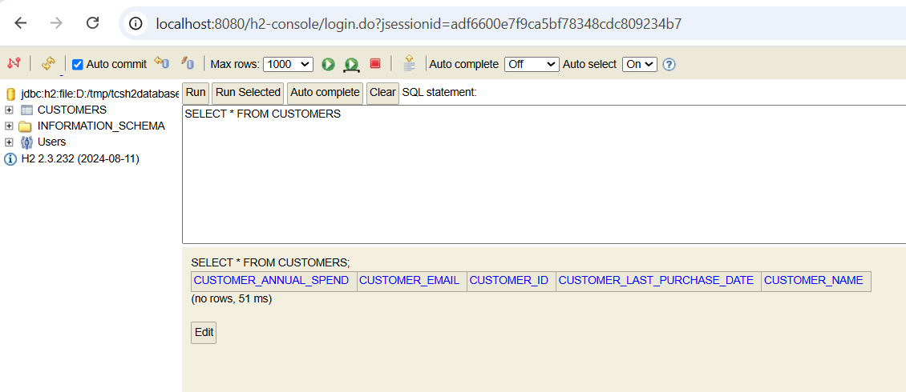

### Below are the configurations used related to h2 database
spring.h2.console.enabled=true
spring.h2.console.path=/h2-console

spring.datasource.url=jdbc:h2:file:D:/tmp/tcsh2database
spring.datasource.driverClassName=org.h2.Driver
spring.datasource.username=tcsassignment
spring.datasource.password=

spring.jpa.show-sql=true
spring.jpa.properties.hibernate.dialect=org.hibernate.dialect.H2Dialect
spring.jpa.hibernate.ddl-auto= create-drop

### Below are postman collections used to test the functionality
### API-1: Create API
- As mentioned in the assessment, we have provided below requestBody and generated UUID in the Entity class using generator Algorithm
- {
  "name": "anji10002",
  "email": "test33@gmail.com",
  "lastPurchaseDate": "2025-04-16T07:50:41.538956100Z",
  "annualSpend": 100002
  }
- here we are doing the validations on name and email as suggested in the document
- So,as part of this request we are storing the customer details in database

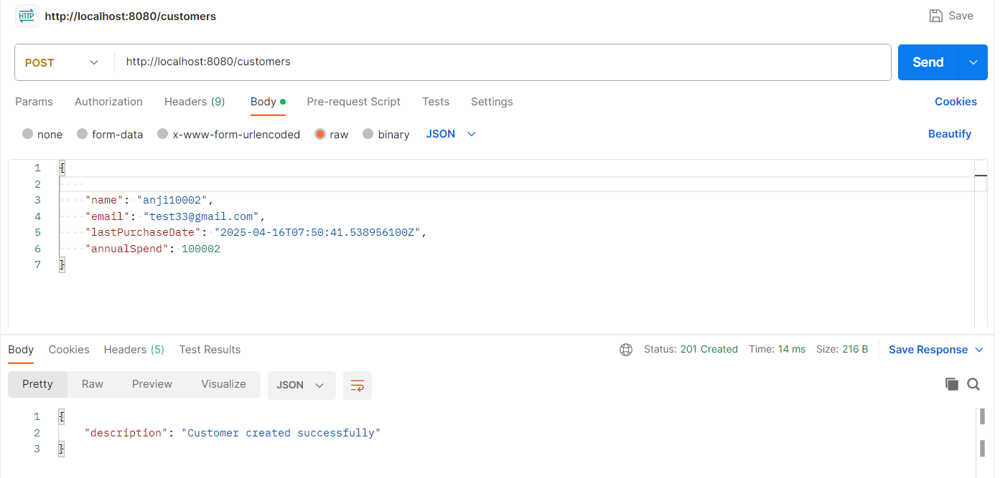

### API-2: Get Customer details based on id (UUID)
- As part of the path variable, we provide id and it will fetch the data from datbase, if the record is not found, we are returning 404
- As part of response, we are provinf a message to user that "Customer details retried successfully"
- Below is the logic we are maintaining to identify type of user based on the amount spending on the system
- Silver: Annual spend < $1000
  • Gold: Annual spend >= $1000 and < $10000 and purchased within the last 12 months.
  • Platinum: Annual spend >= $10000 and purchased within the last 6 months.

- 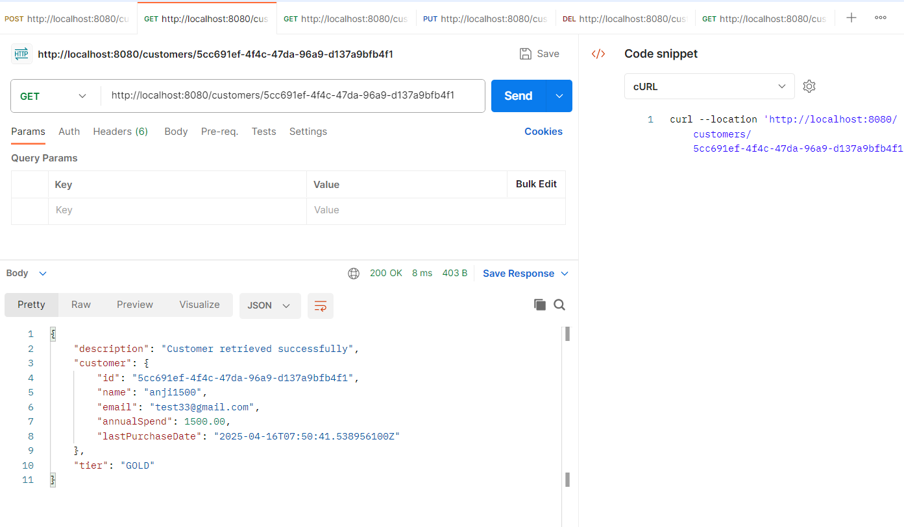
- Below is the response we got
- {
  "description": "Customer retrieved successfully",
  "customer": {
  "id": "5cc691ef-4f4c-47da-96a9-d137a9bfb4f1",
  "name": "anji1500",
  "email": "test33@gmail.com",
  "annualSpend": 1500.00,
  "lastPurchaseDate": "2025-04-16T07:50:41.538956100Z"
  },
  "tier": "GOLD"

### API-3: Get customer data based on name
- In this system, name and email are the required attributes.
- As part of this request, We provide Request Param as part of the request to get the customer details from database
- 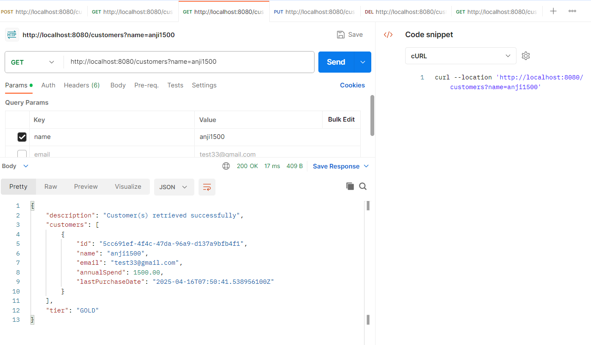
- in this API also, used email as Request parameter as suggested in the document and got the customer details from database.
- for the specific email, if the data is not present we are showing 404 response saying that record not found
- Silver: Annual spend < $1000
    • Gold: Annual spend >= $1000 and < $10000 and purchased within the last 12 months.
    • Platinum: Annual spend >= $10000 and purchased within the last 6 months.

- As shown in the screenshot I got the response
- {
  "description": "Customer(s) retrieved successfully",
  "customers": [
  {
  "id": "5cc691ef-4f4c-47da-96a9-d137a9bfb4f1",
  "name": "anji1500",
  "email": "test33@gmail.com",
  "annualSpend": 1500.00,
  "lastPurchaseDate": "2025-04-16T07:50:41.538956100Z"
  }
  ],
  "tier": "GOLD"
  }
- http://localhost:8080/customers?name=anji1500

### API-4: Get customer data based on email
- email is one of the required attribute in the system
- in this API also, used email as Request parameter as suggested in the document and got the customer details from database.
- Silver: Annual spend < $1000
    • Gold: Annual spend >= $1000 and < $10000 and purchased within the last 12 months.
    • Platinum: Annual spend >= $10000 and purchased within the last 6 months.

- for the specific email, if the data is not present we are showing 404 response saying that record not found

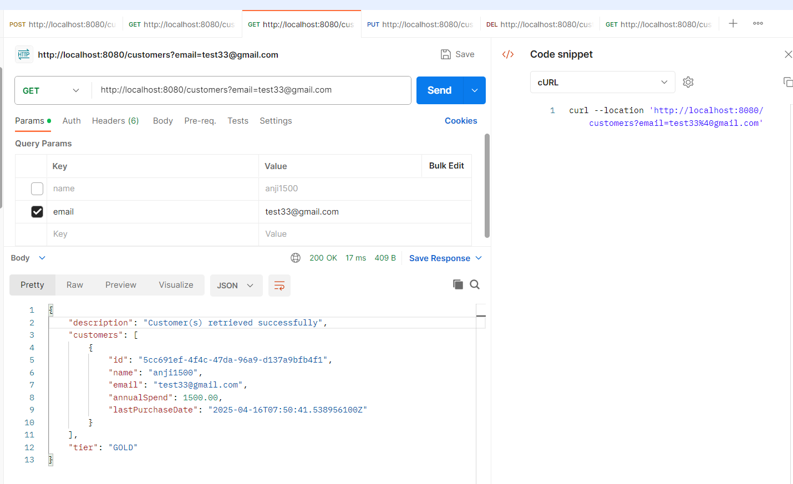
http://localhost:8080/customers?email=test33@gmail.com

### API-5: Modifying the customer data based on the id (UUID)

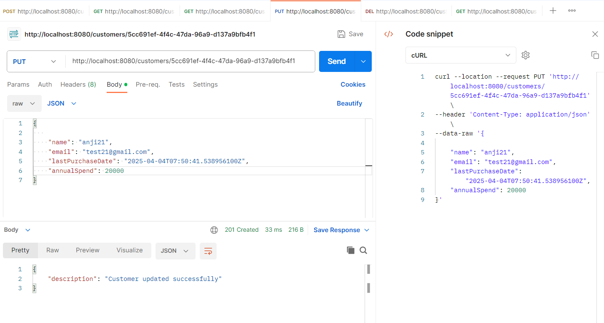
- As shown in the screenshot, I have passed UUID and if the id is already found in the database, we are updating the customer details.
- In this case, except UUID, all other attribues we are able to modify and it is working as expected
- http://localhost:8080/customers/5cc691ef-4f4c-47da-96a9-d137a9bfb4f1

### API-6: Delete the customer record based on the id (UUID)

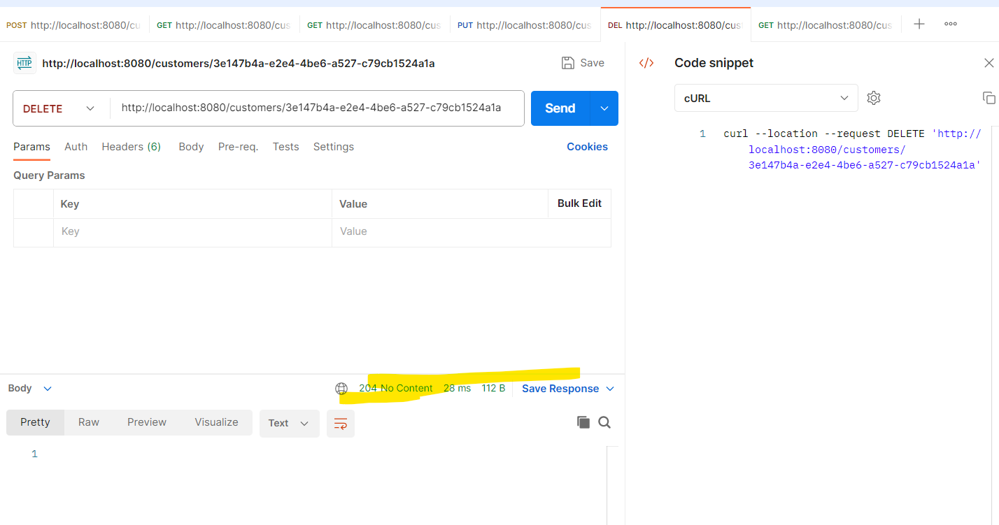

- As shown in the screenshot, as a path variable passed UUID and if the id ofunf in database, we are simpley deleting from database.
- http://localhost:8080/customers/3e147b4a-e2e4-4be6-a527-c79cb1524a1a

- I have implemented Global Exception Handler to handle the exceptions globally
- 
### Junits
- I have written integration testcases, to test the functionality
- I have added proper assertions wherever they required
- I have added Java doc in all logic
- I have taken Open API specification as reference, and gone through the assesment document to implement the functionality

I have taken below assumptions, accordingly built the APIS
- I did not use "id" attribute as part of requestBody in post call
- Displayed id and other attributes as part of response. like below
- {

  "name": "anji10002",
  "email": "test33@gmail.com",
  "lastPurchaseDate": "2025-04-16T07:50:41.538956100Z",
  "annualSpend": 100002
  }

- I have generated the UUID in backend only in Customer Entity with Identity Generator as UUID.
- Always UUID is unique, and it will contain only one record. Accordingly I have prepared CutomerResponse class to render response
- 
- When we search customer details with name, there is chance of getting multiple records. Why because, multiple persons can have same name. In that case I have returned List<CustomerResponse>

- Same case with customer email also, there is chance of getting multiple records. Why because, multiple persons can have same name. In that case I have returned List<CustomerResponse>
- "lastPurchaseDate" attribute, I have stored value in ISO UST format as mentioned in document
- "annualSpend" attributes plays vital role to identify the customer type, in the last 12 months, Whoever spent more money, we have categorized the customers accordingly.
- "id" UUID (Eg. c37f856f-6de7-4f31-956b-0e878980423a) which is generated by the system only.
- "tier" attribute also I have introduced.

"C:\Program Files\Java\jdk-17\bin\java.exe" "-javaagent:C:\Program Files\JetBrains\IntelliJ IDEA Community Edition 2022.3.3\lib\idea_rt.jar=62094:C:\Program Files\JetBrains\IntelliJ IDEA Community Edition 2022.3.3\bin" -Dfile.encoding=UTF-8 -classpath "D:\practice\tcs-assignment-1\tcs-spring-boot-h2-assignment\tcs-spring-boot-h2-assignment\target\classes;C:\Users\Anjaneyelu Neerati\.m2\repository\org\springframework\boot\spring-boot-starter-data-jpa\3.4.5\spring-boot-starter-data-jpa-3.4.5.jar;C:\Users\Anjaneyelu Neerati\.m2\repository\org\springframework\boot\spring-boot-starter\3.4.5\spring-boot-starter-3.4.5.jar;C:\Users\Anjaneyelu Neerati\.m2\repository\org\springframework\boot\spring-boot\3.4.5\spring-boot-3.4.5.jar;C:\Users\Anjaneyelu Neerati\.m2\repository\org\springframework\boot\spring-boot-autoconfigure\3.4.5\spring-boot-autoconfigure-3.4.5.jar;C:\Users\Anjaneyelu Neerati\.m2\repository\org\springframework\boot\spring-boot-starter-logging\3.4.5\spring-boot-starter-logging-3.4.5.jar;C:\Users\Anjaneyelu Neerati\.m2\repository\ch\qos\logback\logback-classic\1.5.18\logback-classic-1.5.18.jar;C:\Users\Anjaneyelu Neerati\.m2\repository\ch\qos\logback\logback-core\1.5.18\logback-core-1.5.18.jar;C:\Users\Anjaneyelu Neerati\.m2\repository\org\apache\logging\log4j\log4j-to-slf4j\2.24.3\log4j-to-slf4j-2.24.3.jar;C:\Users\Anjaneyelu Neerati\.m2\repository\org\apache\logging\log4j\log4j-api\2.24.3\log4j-api-2.24.3.jar;C:\Users\Anjaneyelu Neerati\.m2\repository\org\slf4j\jul-to-slf4j\2.0.17\jul-to-slf4j-2.0.17.jar;C:\Users\Anjaneyelu Neerati\.m2\repository\jakarta\annotation\jakarta.annotation-api\2.1.1\jakarta.annotation-api-2.1.1.jar;C:\Users\Anjaneyelu Neerati\.m2\repository\org\yaml\snakeyaml\2.3\snakeyaml-2.3.jar;C:\Users\Anjaneyelu Neerati\.m2\repository\org\springframework\boot\spring-boot-starter-jdbc\3.4.5\spring-boot-starter-jdbc-3.4.5.jar;C:\Users\Anjaneyelu Neerati\.m2\repository\com\zaxxer\HikariCP\5.1.0\HikariCP-5.1.0.jar;C:\Users\Anjaneyelu Neerati\.m2\repository\org\springframework\spring-jdbc\6.2.6\spring-jdbc-6.2.6.jar;C:\Users\Anjaneyelu Neerati\.m2\repository\org\hibernate\orm\hibernate-core\6.6.13.Final\hibernate-core-6.6.13.Final.jar;C:\Users\Anjaneyelu Neerati\.m2\repository\jakarta\persistence\jakarta.persistence-api\3.1.0\jakarta.persistence-api-3.1.0.jar;C:\Users\Anjaneyelu Neerati\.m2\repository\jakarta\transaction\jakarta.transaction-api\2.0.1\jakarta.transaction-api-2.0.1.jar;C:\Users\Anjaneyelu Neerati\.m2\repository\org\jboss\logging\jboss-logging\3.6.1.Final\jboss-logging-3.6.1.Final.jar;C:\Users\Anjaneyelu Neerati\.m2\repository\org\hibernate\common\hibernate-commons-annotations\7.0.3.Final\hibernate-commons-annotations-7.0.3.Final.jar;C:\Users\Anjaneyelu Neerati\.m2\repository\io\smallrye\jandex\3.2.0\jandex-3.2.0.jar;C:\Users\Anjaneyelu Neerati\.m2\repository\com\fasterxml\classmate\1.7.0\classmate-1.7.0.jar;C:\Users\Anjaneyelu Neerati\.m2\repository\net\bytebuddy\byte-buddy\1.15.11\byte-buddy-1.15.11.jar;C:\Users\Anjaneyelu Neerati\.m2\repository\org\glassfish\jaxb\jaxb-runtime\4.0.5\jaxb-runtime-4.0.5.jar;C:\Users\Anjaneyelu Neerati\.m2\repository\org\glassfish\jaxb\jaxb-core\4.0.5\jaxb-core-4.0.5.jar;C:\Users\Anjaneyelu Neerati\.m2\repository\org\eclipse\angus\angus-activation\2.0.2\angus-activation-2.0.2.jar;C:\Users\Anjaneyelu Neerati\.m2\repository\org\glassfish\jaxb\txw2\4.0.5\txw2-4.0.5.jar;C:\Users\Anjaneyelu Neerati\.m2\repository\com\sun\istack\istack-commons-runtime\4.1.2\istack-commons-runtime-4.1.2.jar;C:\Users\Anjaneyelu Neerati\.m2\repository\jakarta\inject\jakarta.inject-api\2.0.1\jakarta.inject-api-2.0.1.jar;C:\Users\Anjaneyelu Neerati\.m2\repository\org\antlr\antlr4-runtime\4.13.0\antlr4-runtime-4.13.0.jar;C:\Users\Anjaneyelu Neerati\.m2\repository\org\springframework\data\spring-data-jpa\3.4.5\spring-data-jpa-3.4.5.jar;C:\Users\Anjaneyelu Neerati\.m2\repository\org\springframework\data\spring-data-commons\3.4.5\spring-data-commons-3.4.5.jar;C:\Users\Anjaneyelu Neerati\.m2\repository\org\springframework\spring-orm\6.2.6\spring-orm-6.2.6.jar;C:\Users\Anjaneyelu Neerati\.m2\repository\org\springframework\spring-context\6.2.6\spring-context-6.2.6.jar;C:\Users\Anjaneyelu Neerati\.m2\repository\org\springframework\spring-aop\6.2.6\spring-aop-6.2.6.jar;C:\Users\Anjaneyelu Neerati\.m2\repository\org\springframework\spring-tx\6.2.6\spring-tx-6.2.6.jar;C:\Users\Anjaneyelu Neerati\.m2\repository\org\springframework\spring-beans\6.2.6\spring-beans-6.2.6.jar;C:\Users\Anjaneyelu Neerati\.m2\repository\org\slf4j\slf4j-api\2.0.17\slf4j-api-2.0.17.jar;C:\Users\Anjaneyelu Neerati\.m2\repository\org\springframework\spring-aspects\6.2.6\spring-aspects-6.2.6.jar;C:\Users\Anjaneyelu Neerati\.m2\repository\org\aspectj\aspectjweaver\1.9.24\aspectjweaver-1.9.24.jar;C:\Users\Anjaneyelu Neerati\.m2\repository\org\springframework\boot\spring-boot-starter-web\3.4.5\spring-boot-starter-web-3.4.5.jar;C:\Users\Anjaneyelu Neerati\.m2\repository\org\springframework\boot\spring-boot-starter-json\3.4.5\spring-boot-starter-json-3.4.5.jar;C:\Users\Anjaneyelu Neerati\.m2\repository\com\fasterxml\jackson\core\jackson-databind\2.18.3\jackson-databind-2.18.3.jar;C:\Users\Anjaneyelu Neerati\.m2\repository\com\fasterxml\jackson\core\jackson-annotations\2.18.3\jackson-annotations-2.18.3.jar;C:\Users\Anjaneyelu Neerati\.m2\repository\com\fasterxml\jackson\core\jackson-core\2.18.3\jackson-core-2.18.3.jar;C:\Users\Anjaneyelu Neerati\.m2\repository\com\fasterxml\jackson\datatype\jackson-datatype-jdk8\2.18.3\jackson-datatype-jdk8-2.18.3.jar;C:\Users\Anjaneyelu Neerati\.m2\repository\com\fasterxml\jackson\datatype\jackson-datatype-jsr310\2.18.3\jackson-datatype-jsr310-2.18.3.jar;C:\Users\Anjaneyelu Neerati\.m2\repository\com\fasterxml\jackson\module\jackson-module-parameter-names\2.18.3\jackson-module-parameter-names-2.18.3.jar;C:\Users\Anjaneyelu Neerati\.m2\repository\org\springframework\boot\spring-boot-starter-tomcat\3.4.5\spring-boot-starter-tomcat-3.4.5.jar;C:\Users\Anjaneyelu Neerati\.m2\repository\org\apache\tomcat\embed\tomcat-embed-core\10.1.40\tomcat-embed-core-10.1.40.jar;C:\Users\Anjaneyelu Neerati\.m2\repository\org\apache\tomcat\embed\tomcat-embed-websocket\10.1.40\tomcat-embed-websocket-10.1.40.jar;C:\Users\Anjaneyelu Neerati\.m2\repository\org\springframework\spring-web\6.2.6\spring-web-6.2.6.jar;C:\Users\Anjaneyelu Neerati\.m2\repository\io\micrometer\micrometer-observation\1.14.6\micrometer-observation-1.14.6.jar;C:\Users\Anjaneyelu Neerati\.m2\repository\io\micrometer\micrometer-commons\1.14.6\micrometer-commons-1.14.6.jar;C:\Users\Anjaneyelu Neerati\.m2\repository\org\springframework\spring-webmvc\6.2.6\spring-webmvc-6.2.6.jar;C:\Users\Anjaneyelu Neerati\.m2\repository\org\springframework\spring-expression\6.2.6\spring-expression-6.2.6.jar;C:\Users\Anjaneyelu Neerati\.m2\repository\com\h2database\h2\2.3.232\h2-2.3.232.jar;C:\Users\Anjaneyelu Neerati\.m2\repository\jakarta\validation\jakarta.validation-api\3.0.2\jakarta.validation-api-3.0.2.jar;C:\Users\Anjaneyelu Neerati\.m2\repository\org\springframework\boot\spring-boot-starter-validation\3.4.5\spring-boot-starter-validation-3.4.5.jar;C:\Users\Anjaneyelu Neerati\.m2\repository\org\apache\tomcat\embed\tomcat-embed-el\10.1.40\tomcat-embed-el-10.1.40.jar;C:\Users\Anjaneyelu Neerati\.m2\repository\org\hibernate\validator\hibernate-validator\8.0.2.Final\hibernate-validator-8.0.2.Final.jar;C:\Users\Anjaneyelu Neerati\.m2\repository\jakarta\xml\bind\jakarta.xml.bind-api\4.0.2\jakarta.xml.bind-api-4.0.2.jar;C:\Users\Anjaneyelu Neerati\.m2\repository\jakarta\activation\jakarta.activation-api\2.1.3\jakarta.activation-api-2.1.3.jar;C:\Users\Anjaneyelu Neerati\.m2\repository\org\springframework\spring-core\6.2.6\spring-core-6.2.6.jar;C:\Users\Anjaneyelu Neerati\.m2\repository\org\springframework\spring-jcl\6.2.6\spring-jcl-6.2.6.jar" com.tcs.customer.curd.api.springboot.h2.assignment.TcsSpringBootH2AssignmentApplication

.   ____          _            __ _ _
/\\ / ___'_ __ _ _(_)_ __  __ _ \ \ \ \
( ( )\___ | '_ | '_| | '_ \/ _` | \ \ \ \
\\/  ___)| |_)| | | | | || (_| |  ) ) ) )
'  |____| .__|_| |_|_| |_\__, | / / / /
=========|_|==============|___/=/_/_/_/

:: Spring Boot ::                (v3.4.5)

2025-05-08T15:32:40.360-05:00  INFO 22836 --- [           main] h.a.TcsSpringBootH2AssignmentApplication : Starting TcsSpringBootH2AssignmentApplication using Java 17.0.6 with PID 22836 (D:\practice\tcs-assignment-1\tcs-spring-boot-h2-assignment\tcs-spring-boot-h2-assignment\target\classes started by Anjaneyelu Neerati in D:\practice\tcs-assignment-1\tcs-spring-boot-h2-assignment\tcs-spring-boot-h2-assignment)
2025-05-08T15:32:40.368-05:00  INFO 22836 --- [           main] h.a.TcsSpringBootH2AssignmentApplication : No active profile set, falling back to 1 default profile: "default"
2025-05-08T15:32:42.024-05:00  INFO 22836 --- [           main] .s.d.r.c.RepositoryConfigurationDelegate : Bootstrapping Spring Data JPA repositories in DEFAULT mode.
2025-05-08T15:32:42.173-05:00  INFO 22836 --- [           main] .s.d.r.c.RepositoryConfigurationDelegate : Finished Spring Data repository scanning in 126 ms. Found 1 JPA repository interface.
2025-05-08T15:32:43.416-05:00  INFO 22836 --- [           main] o.s.b.w.embedded.tomcat.TomcatWebServer  : Tomcat initialized with port 8080 (http)
2025-05-08T15:32:43.448-05:00  INFO 22836 --- [           main] o.apache.catalina.core.StandardService   : Starting service [Tomcat]
2025-05-08T15:32:43.448-05:00  INFO 22836 --- [           main] o.apache.catalina.core.StandardEngine    : Starting Servlet engine: [Apache Tomcat/10.1.40]
2025-05-08T15:32:43.680-05:00  INFO 22836 --- [           main] o.a.c.c.C.[Tomcat].[localhost].[/]       : Initializing Spring embedded WebApplicationContext
2025-05-08T15:32:43.683-05:00  INFO 22836 --- [           main] w.s.c.ServletWebServerApplicationContext : Root WebApplicationContext: initialization completed in 3192 ms
2025-05-08T15:32:44.044-05:00  INFO 22836 --- [           main] o.hibernate.jpa.internal.util.LogHelper  : HHH000204: Processing PersistenceUnitInfo [name: default]
2025-05-08T15:32:44.145-05:00  INFO 22836 --- [           main] org.hibernate.Version                    : HHH000412: Hibernate ORM core version 6.6.13.Final
2025-05-08T15:32:44.223-05:00  INFO 22836 --- [           main] o.h.c.internal.RegionFactoryInitiator    : HHH000026: Second-level cache disabled
2025-05-08T15:32:44.787-05:00  INFO 22836 --- [           main] o.s.o.j.p.SpringPersistenceUnitInfo      : No LoadTimeWeaver setup: ignoring JPA class transformer
2025-05-08T15:32:44.864-05:00  INFO 22836 --- [           main] com.zaxxer.hikari.HikariDataSource       : HikariPool-1 - Starting...
2025-05-08T15:32:45.394-05:00  INFO 22836 --- [           main] com.zaxxer.hikari.pool.HikariPool        : HikariPool-1 - Added connection conn0: url=jdbc:h2:file:D:/tmp/tcsh2database user=TCSASSIGNMENT
2025-05-08T15:32:45.397-05:00  INFO 22836 --- [           main] com.zaxxer.hikari.HikariDataSource       : HikariPool-1 - Start completed.
2025-05-08T15:32:45.445-05:00  WARN 22836 --- [           main] org.hibernate.orm.deprecation            : HHH90000025: H2Dialect does not need to be specified explicitly using 'hibernate.dialect' (remove the property setting and it will be selected by default)
2025-05-08T15:32:45.496-05:00  INFO 22836 --- [           main] org.hibernate.orm.connections.pooling    : HHH10001005: Database info:
Database JDBC URL [Connecting through datasource 'HikariDataSource (HikariPool-1)']
Database driver: undefined/unknown
Database version: 2.3.232
Autocommit mode: undefined/unknown
Isolation level: undefined/unknown
Minimum pool size: undefined/unknown
Maximum pool size: undefined/unknown
2025-05-08T15:32:46.888-05:00  INFO 22836 --- [           main] o.h.e.t.j.p.i.JtaPlatformInitiator       : HHH000489: No JTA platform available (set 'hibernate.transaction.jta.platform' to enable JTA platform integration)
Hibernate: drop table if exists customers cascade
Hibernate: create table customers (customer_annual_spend numeric(38,2), customer_email varchar(255), customer_id varchar(255) not null, customer_last_purchase_date varchar(255), customer_name varchar(255), primary key (customer_id))
2025-05-08T15:32:46.924-05:00  INFO 22836 --- [           main] j.LocalContainerEntityManagerFactoryBean : Initialized JPA EntityManagerFactory for persistence unit 'default'
2025-05-08T15:32:47.704-05:00  WARN 22836 --- [           main] JpaBaseConfiguration$JpaWebConfiguration : spring.jpa.open-in-view is enabled by default. Therefore, database queries may be performed during view rendering. Explicitly configure spring.jpa.open-in-view to disable this warning
2025-05-08T15:32:48.207-05:00  INFO 22836 --- [           main] o.s.b.a.h2.H2ConsoleAutoConfiguration    : H2 console available at '/h2-console'. Database available at 'jdbc:h2:file:D:/tmp/tcsh2database'
2025-05-08T15:32:48.325-05:00  INFO 22836 --- [           main] o.s.b.w.embedded.tomcat.TomcatWebServer  : Tomcat started on port 8080 (http) with context path '/'
2025-05-08T15:32:48.337-05:00  INFO 22836 --- [           main] h.a.TcsSpringBootH2AssignmentApplication : Started TcsSpringBootH2AssignmentApplication in 8.859 seconds (process running for 9.485)

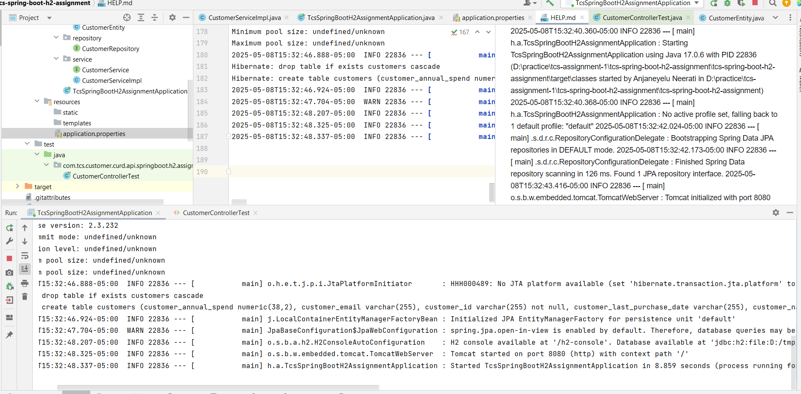

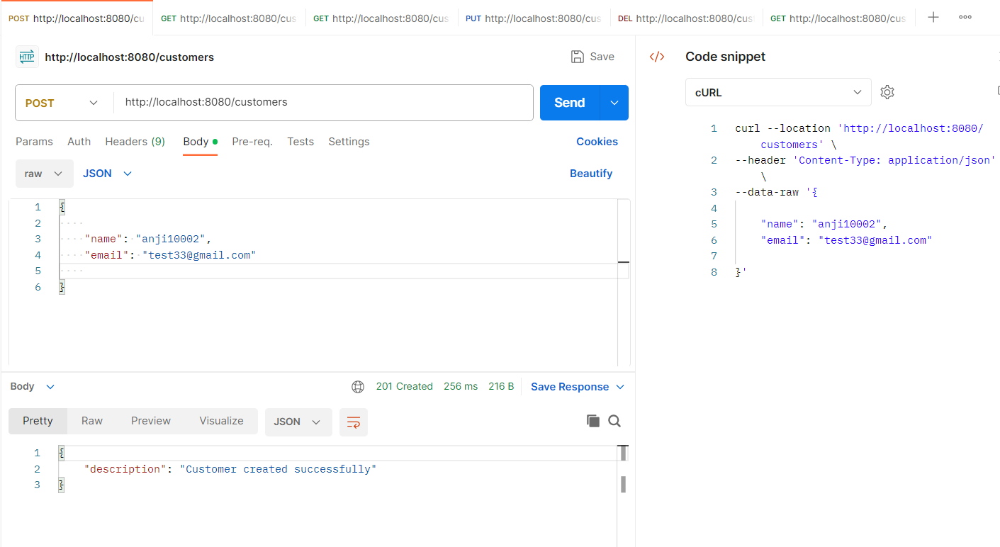

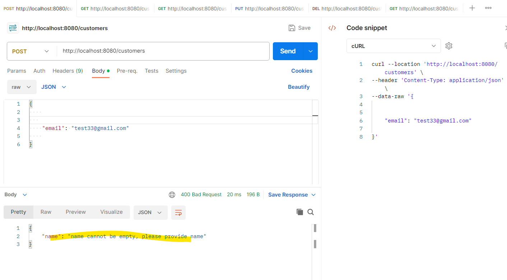

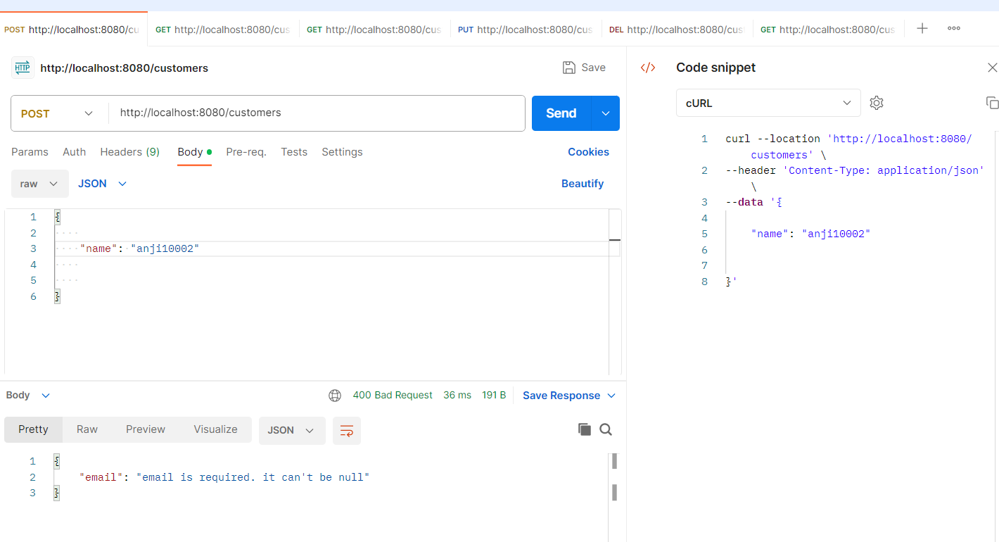

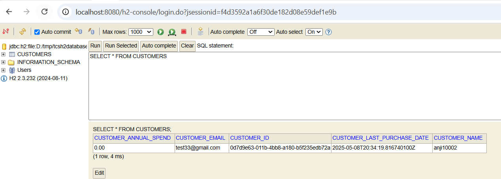

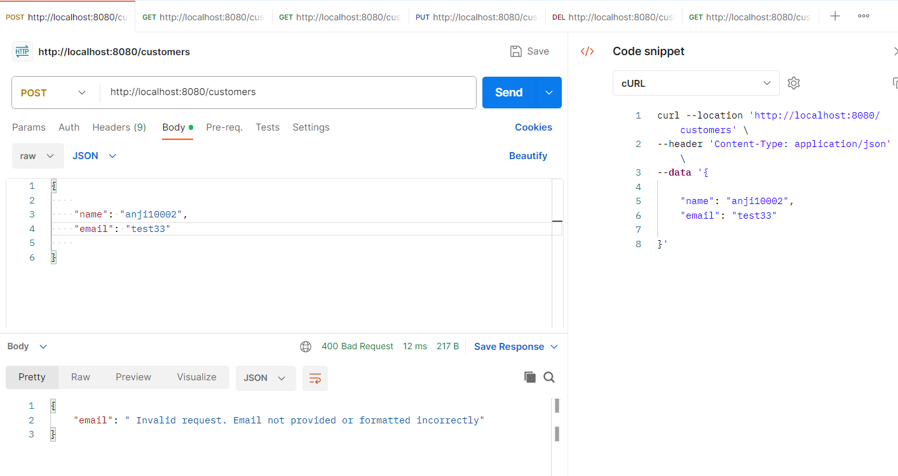

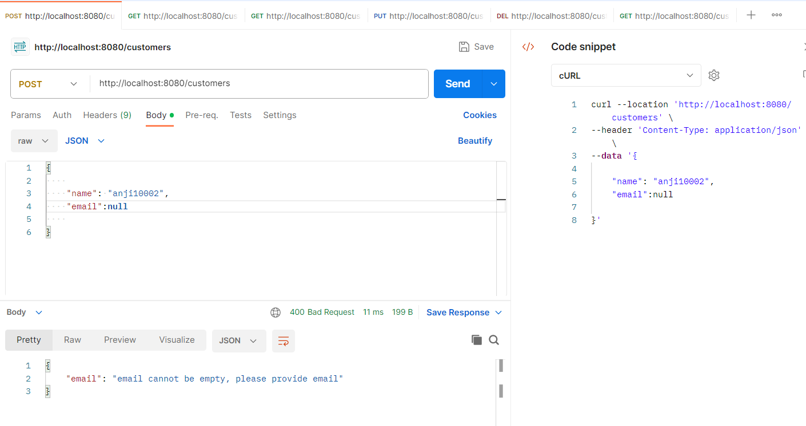

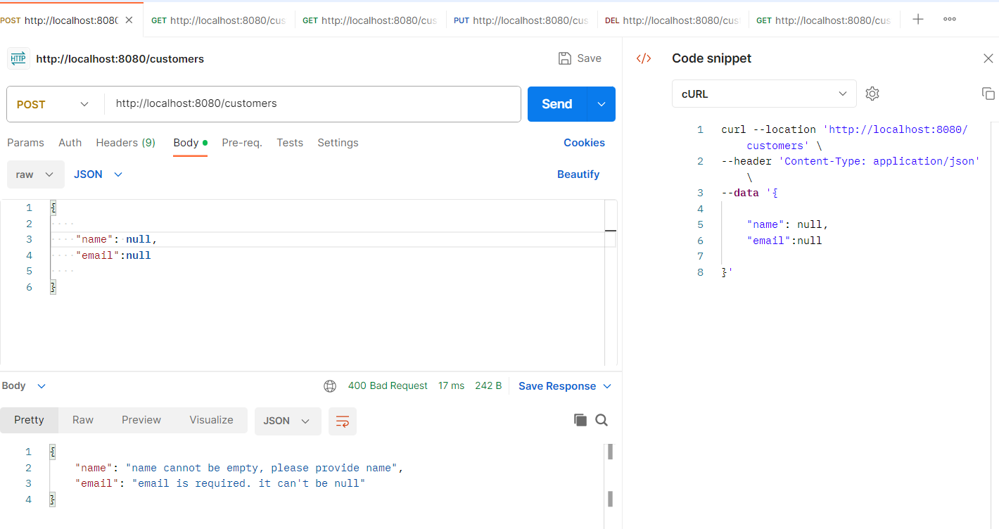

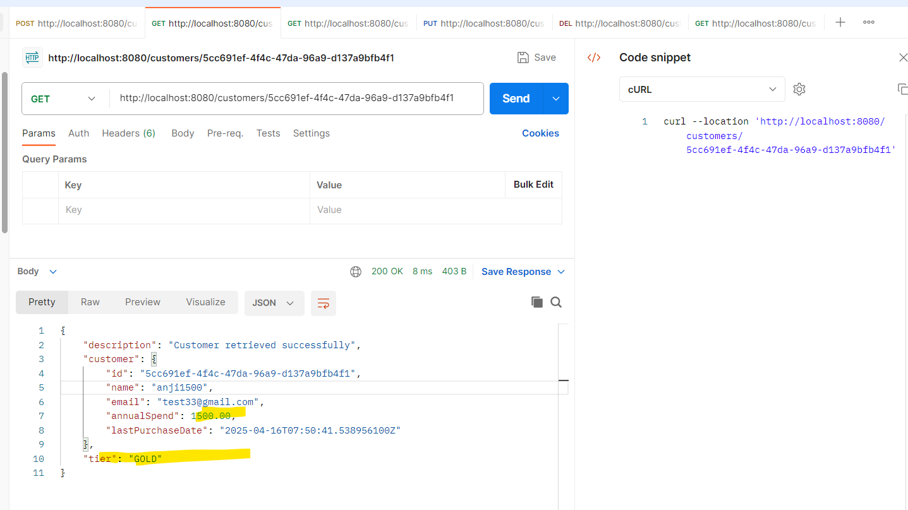

Implemented all sections as mentioned in the assessment document
Java Spring Boot Coding Challenge: Customer Management API
Objective:
Develop a Spring Boot RESTful API to manage customer data. This API will support basic
CRUD operations and include logic to calculate a customer’s membership tier based on
their annualSpend. The API should be documented with an OpenAPI spec, and the project
should include unit tests and a README.md file.
Challenge Requirements
1.
2.
Project Setup
• Use Spring Boot to create a RESTful API service.
• Use H2 as the in-memory database for local testing.
• Implement the project in Java with Maven or Gradle.
• Configure the application to run locally.
API Requirements
Customer Definition
Each customer should have the following fields:
• id (UUID, generated by the system)
• name (String, required)
• email (String, required, with basic format validation)
• annualSpend (Decimal, optional)
• lastPurchaseDate (ISO 8601 format, optional)
Endpoints
Implement the following CRUD endpoints:
• POST /customers: Create a new customer. The request body should exclude the id field, as
this will be auto-generated.  Response will include the full model with the generate ID.
• GET /customers/{id}: Retrieve a customer by their unique ID.
• GET /customers?name={name}:  Retrieve a customer by name.
• GET /customers?email={email}: Retrieve a customer by email.
• PUT /customers/{id}: Update customer details by ID. All fields should be updatable except
id.
• DELETE /customers/{id}: Delete a customer by ID.

Business Logic Requirements
Implement on-the-fly tier calculation based on annualSpend when retrieving a customer.
• Silver: Annual spend < $1000
• Gold: Annual spend >= $1000 and < $10000 and purchased within the last 12 months.
• Platinum: Annual spend >= $10000 and purchased within the last 6 months.
The calculated tier should not be stored in the database but should appear in the response
when a customer is retrieved.
OpenAPI Specification
Utilize an OpenAPI specification (openapi.yaml or openapi.json) that includes (see sample
below):
• Descriptions of the CRUD endpoints.
• Request and response bodies.
• Basic error handling for scenarios like invalid customer creation requests (e.g., missing or
invalid email, missing required fields).
• Ensure that the POST /customers endpoint requires the absence of an id field in the request
body.
Unit Testing Requirements
Write unit tests to cover:
• CRUD operations (create, retrieve, update, delete).
• Tier calculation based on annualSpend.
• Basic validation of the email field format.
• The tests should verify that the customer’s tier is calculated correctly based on various
annualSpend values.
Delivery and Documentation
README: Include a README.md file with instructions on:
• How to build and run the application.
• Sample requests to test each endpoint.
• Instructions for accessing the H2 database console (if needed).
• Any assumptions made in your implementation.
Code Delivery: Submit your solution by uploading it to a private GitHub repository (or another
public Git provider) and share the access link, or compress it as a .zip file for direct submission.
Open API Specification:  The following OpenAPI spec is for reference purposes and can be used or
not used as preferred.
openapi: 3.0.0
info:
title: Customer Management API
version: 1.0.0
paths:
/customers:
post:
summary: Create a new customer
requestBody:
content:
application/json:
schema:
$ref: '#/components/schemas/CustomerRequest'
responses:
'201':
description: Customer created successfully
'400':
description: Invalid request (e.g., email not provided or formatted
incorrectly)
/customers/{id}:
get:
summary: Retrieve a customer by ID
parameters: - in: path
name: id
required: true
schema:
type: string
responses:
'200':
description: Customer retrieved successfully
content:
application/json:
schema:
$ref: '#/components/schemas/CustomerResponse'
'404':
description: Customer not found
components:
schemas:
CustomerRequest:
type: object
properties:
name:
type: string
email:
type: string
annualSpend:
type: number
format: double
lastPurchaseDate:
type: string
format: date-time
required: - name - email
CustomerResponse:
allOf: - $ref: '#/components/schemas/CustomerRequest' - type: object
properties:
id:
type: string
tier:
type: string
enum: - Silver - Gold - Platinum 

